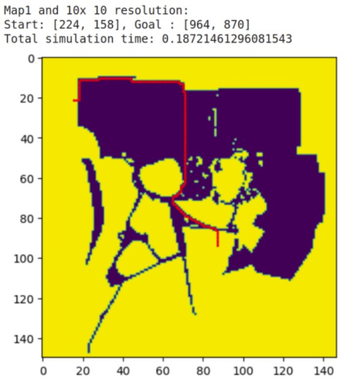

# Implementation of A-Star and Dijkstra on a Quarry area
# Introduction
I have implemented both the A-Star and Dijkstra algorithms as part of my coursework. The code was written and executed in Google Colab. These algorithms were used to find paths across three different resolutions of the same occupancy grid map. Finally, an evaluation was conducted focusing on:
1. The computation time of the algorithm for the different resolutions.
2. The computation time and results of both algorithms.
   
# Implementation
Dowload the IPYNB files and open in the google collab and execute all the cells. You can arrange the parameters accordingly or replace your own images.

# This is how the results looks
After implementation, one of the end results look as below:

## A-Star Result:

## Dijkstra Result:

